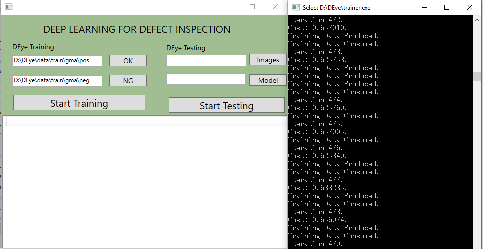
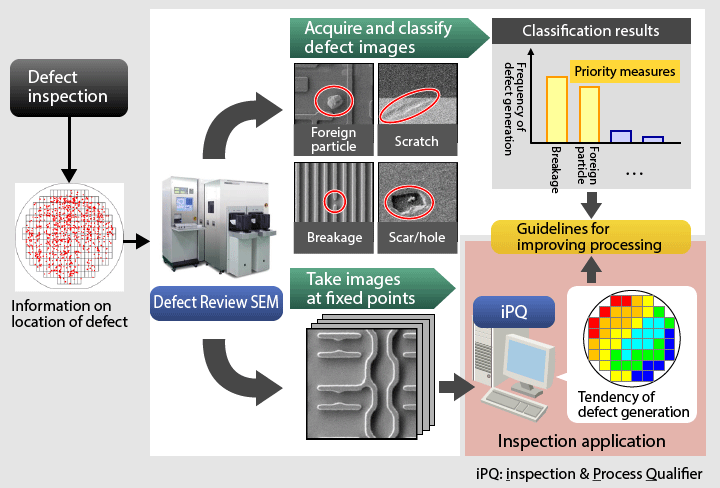
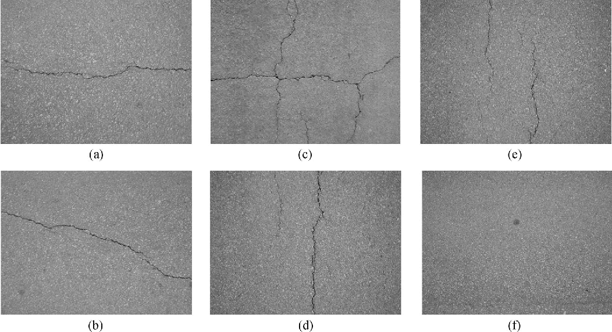
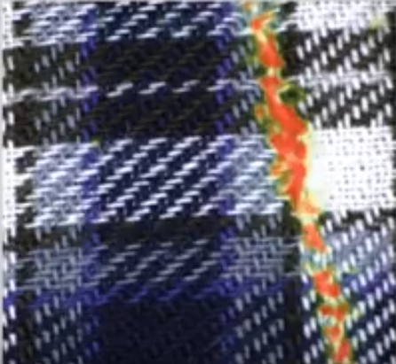
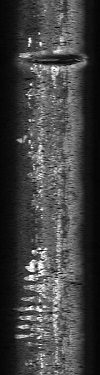
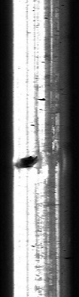
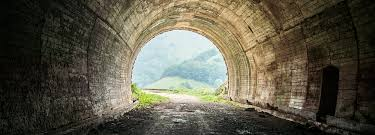
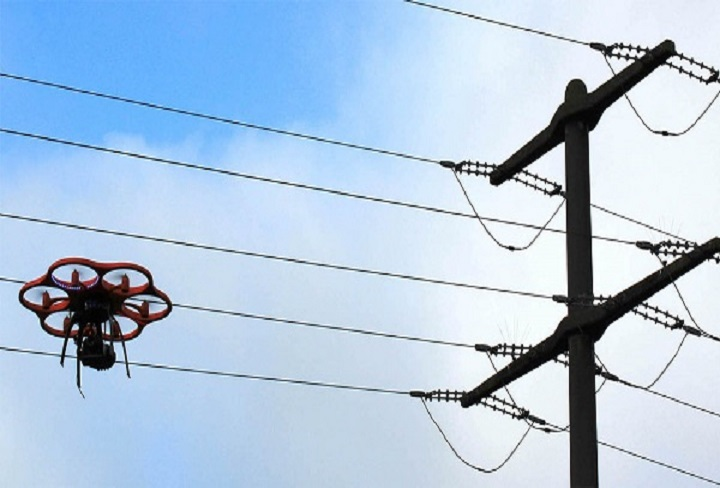
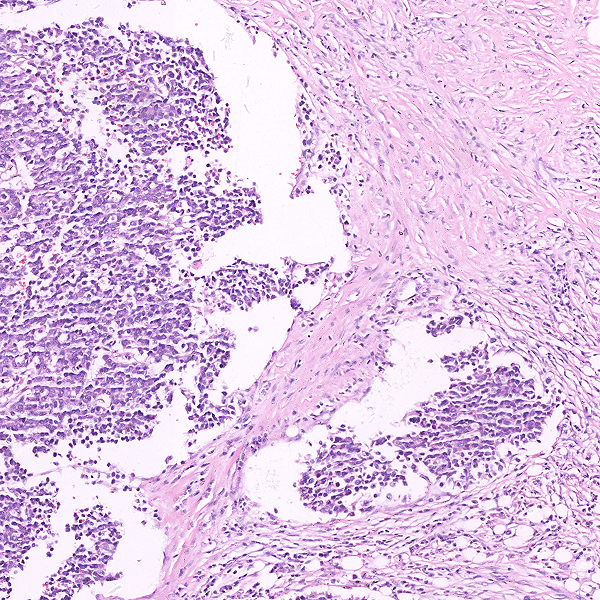

## DEye

### 1. Introduction

Defect Eye is an open source software library based on tensorflow1.4, which focus on surface defect inspection. The application area cover the full range of yield applications within the manufacturing environment, including incoming process tool qualification, wafer qualification, glass surface qualification, reticle qualification, research and development, and tool, process and line monitoring. Patterned and unpatterned wafer defect inspection and qualification tools find particles and pattern defects on the front surface, back surface and edge of the wafer, allowing engineers to detect and monitor critical yield excursions. Also, It can be used for medical image inpsection, including Lung PET/CT,breast MRI, CT Colongraphy, Digital Chest X-ray images.

### 2. Usage

Compiled tensorflow-r1.4 GPU version using CMake,VisualStudio 2015, CUDA8.0, cudnn6.0.

- tensorflow.dll, tensorflow.lib, libprotobuf.lib

- Download Address: Link：https://pan.baidu.com/s/1o9tv1n8 password：ekec

### How to use DEye

- Install VisualStudio Community2015 Install NVIDIA CUDA 8.0

- git clone https://github.com/sundyCoder/DEye

- Download tensorflow.dll, place it under DEye/bin

- Download tensorflow.lib and libprotobuf.lib, place theme under DEye/extra/tensorflow-r1.4/

- Download inception_v3_2016_08_28_frozen.pb, place it under DEye/data

- Open Visual Studio Solution "DEye.sln" which should be under DEye/build/vc14，Solution configurations option choose "Release", Soluton Platform option choose "x64".

- Build and run the GUI project, you can do model training for your inspection cases.

## 3. Applications
### 3.1 IC Chips Defects Inspection

### 3.2 Highway Road Crack Damage Inpection
 
### 3.3 Fabric Defects Inpection

### 3.4 Rail Defects Inpection
 
### 3.5 Civil Infrastructure Defect Detection
  
### 3.6 Power lines Crack Detection

### 3.7 Medical Image Classification

## 4. License
[Apache License 2.0](./LICENSE)
