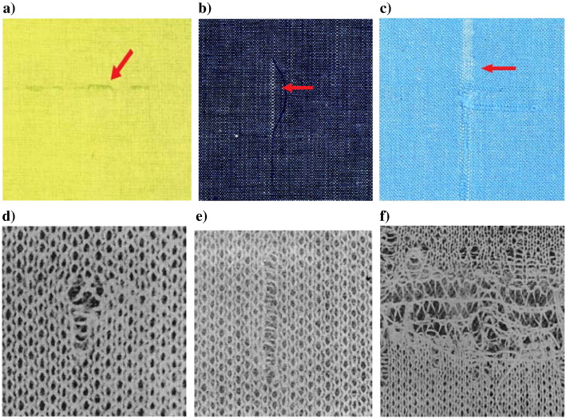
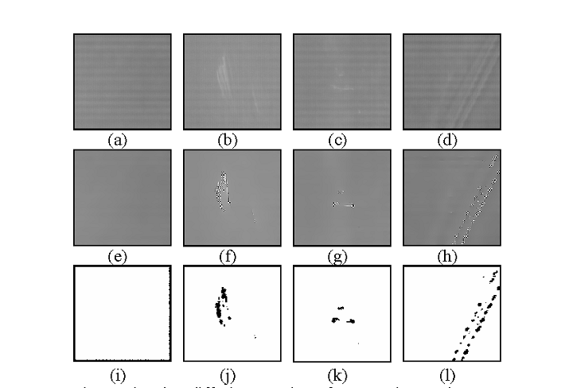

# DEye (Keep an Eye on Defects Inspection)
 

DEye 🚀 linux version is open sourced, please find the source code from the link: https://github.com/sundyCoder/DEye_linux

## 1. Abstract
Defect Eye (DEye) is a deep learning-based software for manufacturing surface defect inspection. It provides the basic function modules to facilitate the development of different defect inspection applications. The applications cover the full rang of manufacturing environment, including incoming process tool qualification, wafer qualification, glass surface qualification, reticle qualification, research and development. Also, It can be used for medical image inpsection, including Lung PET/CT,breast MRI, CT Colongraphy, Digital Chest X-ray images. This software library contains the basic function modules about data processing, model training and model inference. It is developed to reduce the burden of programmers who worked in this field. Based on this software, developers can design the added functions according to their requirements..

<!--  -->

## 2. Usage

Compiled tensorflow-r1.4 GPU version using CMake,VisualStudio 2017, CUDA8.0, cudnn6.0.

- tensorflow.dll, tensorflow.lib, libprotobuf.lib

- Baidu Cloud Link：https://pan.baidu.com/s/1nCfPWbxv03FRaU4kip0yTQ password：jcbu

- Google Drive Link:  https://drive.google.com/open?id=1kANDNErMNLU9wNR3rKhUTz--ltwPNPUv

### How to use DEye

- Please find the user manual in the [User Manual](docs/DEye_User_Manual.pdf).

## 3. Applications

### 3.1 IC Chips Defects Inspection

  

### 3.2 Highway Road Crack Damage Inpection

  

### 3.3 Fabric Defects Inpection

  

### 3.4 Cover Glass Inpection

  

### 3.5 Civil Infrastructure Defect Detection

  

### 3.6 Power lines Crack Detection

  

### 3.7 Medical Image Classification

  

## 4. Datasets

1. **Weakly Supervised Learning for Industrial Optical Inspection**

	[DAGM: https://hci.iwr.uni-heidelberg.de/node/3616](https://hci.iwr.uni-heidelberg.de/node/3616)

2. [**Micro surface defect database**](http://faculty.neu.edu.cn/yunhyan/NEU_surface_defect_database.html)

	[https://pan.baidu.com/s/1QM0AxlGjUlkHHyxwamIMmA](https://pan.baidu.com/s/1QM0AxlGjUlkHHyxwamIMmA)
3. **Oil pollution defect database**

	[https://pan.baidu.com/s/1_aU_Bfh7lcxpYW1no2MlUQ](https://pan.baidu.com/s/1_aU_Bfh7lcxpYW1no2MlUQ)

4. **Bridge Crack Image Data**

	[http://pan.baidu.com/s/1bplPrPl](http://pan.baidu.com/s/1bplPrPl)

5. **ETHZ Datasets**
	
	[ETHZ: http://www.vision.ee.ethz.ch/en/datasets/](http://www.vision.ee.ethz.ch/en/datasets/)
6. **RSDDs dataset**

	[http://icn.bjtu.edu.cn/Visint/resources/RSDDs.aspx](http://icn.bjtu.edu.cn/Visint/resources/RSDDs.aspx)
7. **Crack Forest Datasets**

	[https://github.com/cuilimeng/CrackForest](https://github.com/cuilimeng/CrackForest)
8. **CV Datasets on the Web**

	[http://www.cvpapers.com/datasets.html](http://www.cvpapers.com/datasets.html)

9. **An RGB-D dataset and evaluation methodology for detection and 6D pose estimation of texture-less objects**

	[http://cmp.felk.cvut.cz/t-less/](http://cmp.felk.cvut.cz/t-less/)
	
10. **Pipes defect inspection dataset**
	
	[https://vap.aau.dk/sewer-ml/](https://vap.aau.dk/sewer-ml/)

## 5. Contact
* Email: sundycoder@gmail.com
* QQ:    1316501606

**Notice:  Any comments and suggetions are welcomed, kindly please introduce yourself(name, country, organization etc.) when contact with me, thanks for your cooperation.**

## 6. TODO List
* A user-friendly GUI ( welcome to contact with me if you want to be a collaborator)

## 7. License
[Apache License 2.0](./LICENSE)

## 8. Citation
Use this bibtex to cite the paper or this repository:

	@article{li2022eid,
	  title={EID-GAN: Generative Adversarial Nets for Extremely Imbalanced Data Augmentation},
	  author={Li, Wei and Chen, Jinlin and Cao, Jiannong and Ma, Chao and Wang, Jia and Cui, Xiaohui and Chen, Ping},
	  journal={IEEE Transactions on Industrial Informatics},
	  year={2022},
	  publisher={IEEE}
	}

	@misc{DEye,
	  title={A Deep Learning-based Software for Manufacturing Defect Inspection},
	  author={Sundy},
	  year={2017},
	  publisher={Github},
	  journal={GitHub repository},
	  howpublished={\url{https://github.com/sundyCoder/DEye}},
	}
